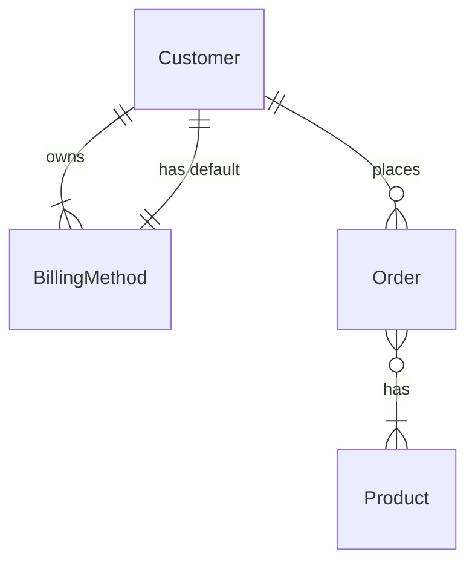

> 💁‍♂️ There are many tools for rendering entity relationship diagrams. In this article we'll talk about using [Mermaid](https://mermaid-js.github.io/mermaid/#/), which just so happens to be how you would do this on GitHub with their flavor of Markdown.

For this example, let's imagine that we're building an online store with the following resources:

- `Customer` represents an individual placing orders in the store.
- `BillingMethod` is the billing information (credit card number, address, etc) for a `Customer`.
- `Order` represents a purchase made by a `Customer`.
- `Product` is an item available for purchase in an `Order`.

#### One-to-many relationship

Before a customer can place any orders, they first need the input their billing information which might include things such as a credit card number and billing address. Just like Amazon, customers should be able to store lots of different billing methods (as they might have more than one credit card).

Since customers might have multiple billing methods (and at least one on file) this is a simple (non-optional) one-to-many relationship (each `Customer` has 1 or more `BillingMethod` resources and each `BillingMethod` is always owned by a single `Customer`).

> ℹ️ In Mermaid, this relationship is modeled using `||--|{` . For example, a `Customer` may have one or more `BillingMethod`s, while a `BillingMethod` has exactly one `Customer` would be modeled as `Customer ||--o{ BillingMethod`.

#### One-to-one relationship

Similar to our one-to-many relationship, we actually have a similar one-to-one relationship in the "default" billing method. In order to place orders quickly, customers must have exactly one default billing method on file (which can be changed to a different billing method at any time).

Since a customer should have only one default billing address, credit card, etc, this is a strict one-to-one relationship (each `Customer` has exactly one default `BillingMethod` resource, and each `BillingMethod` always points to exactly one `Customer`).

> ℹ️ In Mermaid, this relationship is modeled using `||--||` . For example, a `Customer` will have exactly one `BillingMethod` (and vice versa) would be modeled as `Customer ||--|| BillingMethod`.

#### Optional one-to-many relationship

An optional one-to-many relationship is present between customers and orders. Customers might place lots of orders (or none, hence the "optional"), whereas a given order must always be placed by a single customer.

> ℹ️ In Mermaid, this relationship is modeled using `||--o{` . For example, a `Customer` may place 0 or more `Order` resources (and an `Order` always belongs to a single `Customer`) would be modeled as `Customer ||--o{ Order`.

#### Many-to-many relationships

When a customer places an order, that order must have at least one product being ordered, but more likely even more than one. Similarly, there are many different products being sold and each one might be part of lots of different orders (e.g., Customer 1 orders a book, Customer 2 orders the same book).

Since an `Order` is composed of 1 or more `Product` resources, and a `Product` can be referenced in many different `Order` resources (or none), we have a many-to-many relationship. This relationship also happens to be optional on one side.

> ℹ️ In Mermaid, this relationship is modeled using `}o--|{`. For example, a `Order` may have 1 or more `Product` resources being purchased, and a `Product` might be part of 0, 1, or many different `Order` resources. This would be modeled as `Order }o--|{ Product`.

#### Final entity relationship diagram

Thanks to the magic of [Mermaid](https://mermaid-js.github.io/mermaid/#/entityRelationshipDiagram) we can easily generate an ERD from some text. Below you can see the diagram source as well as the rendered ERD.

> 👷‍♂️ There are lots of ways to render these diagrams. One easy one is to use [Mermaid Live Editor](https://mermaid.live) which also has handy buttons to download and copy the rendered diagrams in both PNG and SVG format.

*Mermaid diagram source of all relationships*

